# PhotoVideoBackup — User Guide

> **Version 2.3.0 · iOS**  
> A simple, reliable way to back up your photos and videos to an external SSD.

---

## Table of Contents

1. [What is PhotoVideoBackup?](#1-what-is-photovideobackup)
2. [Free vs Pro](#2-free-vs-pro)
3. [What You Need](#3-what-you-need)
4. [First Launch — Giving Permissions](#4-first-launch--giving-permissions)
5. [Setting Up Your SSD](#5-setting-up-your-ssd)
6. [Backing Up Your iPhone Photos & Videos](#6-backing-up-your-iphone-photos--videos)
7. [Backing Up a Camera SD Card (Pro)](#7-backing-up-a-camera-sd-card-pro)
8. [The Backup in Progress](#8-the-backup-in-progress)
9. [When the Backup Is Done](#9-when-the-backup-is-done)
10. [Viewing Your Backup History](#10-viewing-your-backup-history)
11. [Browsing and Sharing Your Backed-Up Files](#11-browsing-and-sharing-your-backed-up-files)
12. [Using Two SSDs — Mirror Backup (Pro)](#12-using-two-ssds--mirror-backup-pro)
13. [Backing Up to a NAS over Wi-Fi (Pro)](#13-backing-up-to-a-nas-over-wi-fi-pro)
14. [Frequently Asked Questions](#14-frequently-asked-questions)

---

## 1. What is PhotoVideoBackup?

PhotoVideoBackup copies your photos and videos from your iPhone — or from a camera memory card — to a portable SSD (a fast external hard drive) plugged into your iPhone.

**Why use it?**

- Your iPhone storage is getting full and you want to free up space safely.
- You just came back from a trip with an SD card full of footage and want to secure it immediately.
- You want a personal copy of your media that does not depend on iCloud or any online service.
- You shoot with a Blackmagic camera, an Insta360, a DJI drone, or any other camera and need to back up the card on the go.

**What makes it safe?**  
Every file copied is verified with a mathematical fingerprint (SHA-256). If even a single byte is wrong, the app flags it. You will never end up with a silent, corrupted backup.

---

## 2. Free vs Pro

PhotoVideoBackup is free to download. A one-time **Pro upgrade ($1.99 — no subscription)** unlocks two additional features:

| Feature | Free | Pro |
|---------|:----:|:---:|
| Back up your iPhone photo library to an SSD | ✓ | ✓ |
| Add external sources (SD cards, Blackmagic, Insta360, DJI…) | — | ✓ |
| Mirror backup to a second SSD simultaneously | — | ✓ |

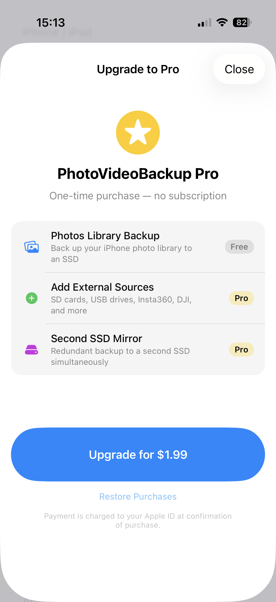

To unlock Pro, tap **Upgrade to Pro** when prompted, or open the upgrade screen from the Settings tab. It is a single payment — you own it forever.

---

## 3. What You Need

| Item | Notes |
|------|-------|
| An iPhone with a **USB-C port** | iPhone 15 or later |
| A **USB-C SSD** | Any portable SSD with a USB-C cable works. Recommended: Samsung T7, SanDisk Extreme, WD My Passport. |
| A **USB-C cable or hub** | The cable that came with your SSD is fine. If you also want to plug in an SD card reader at the same time, you need a small USB-C hub. |
| An **SD card reader** *(optional — Pro)* | Only needed if you want to back up a camera card. Any USB-C SD card reader works. |

> **Tip:** Copying large amounts of video uses battery. Plug your iPhone in or make sure it is well charged before starting.

---

## 4. First Launch — Giving Permissions

The very first time you open PhotoVideoBackup, iOS will ask for permission to access your photo library.

Tap **Allow Full Access**. Without this permission, the app cannot read your photos and videos.

> The app only reads your photos to copy them. It never modifies, deletes, or shares them.

---

## 5. Setting Up Your SSD

Before you can back anything up, you need to tell the app where to save the files and give your device a name.

### Step 1 — Name your device

Tap the **Settings** tab at the bottom of the screen (the gear icon).

At the top of the page you will see an **iPhone / iPad** section with a **Folder name** field. Tap it and type a name that identifies your device — for example **iPhone de Gérard** or **iPad Pro Camille**.

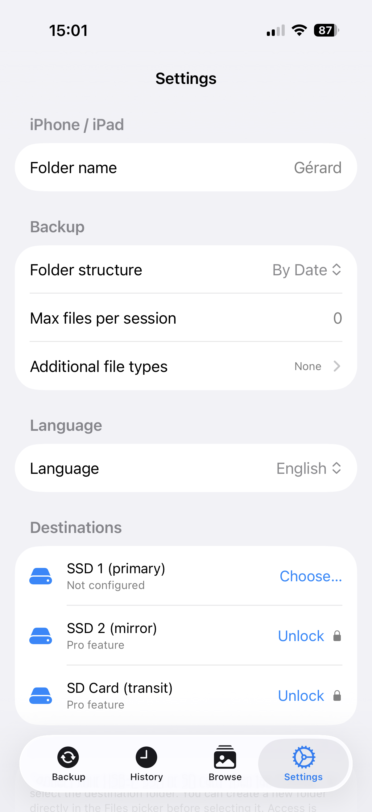

> **This name is used as the folder name on the SSD.** If two people back up to the same SSD, each device needs a different name so their files stay separate. The app will not start a backup until a name is set.

### Step 2 — Plug in your SSD

Connect your SSD to your iPhone using its USB-C cable.

### Step 3 — Choose a destination folder

Below the device name, the **SSD Destinations** section shows two slots. Tap **Choose…** next to "SSD 1 (primary)".

A file browser will open. Navigate to your SSD — it will appear in the list of locations. Tap on it to select the top-level folder (or a specific folder inside it if you prefer to keep things organised).

Tap **Open** in the top-right corner.

The SSD name will now appear in Settings, confirming it is configured. A small red trash icon appears next to it — you can tap it at any time to unconfigure that slot.

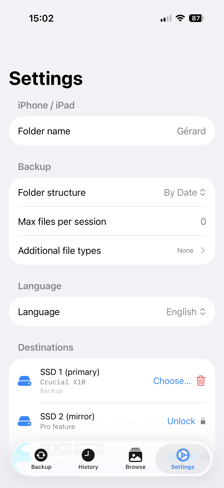

> **Your choice is remembered.** You only need to do this once per SSD. The next time you plug the same SSD in, the app will recognise it automatically.

---

## 6. Backing Up Your iPhone Photos & Videos

### Step 1 — Go to the Backup tab

Tap the **Backup** tab (the house icon at the bottom left).

At the top you will see your SSD with its name, how much space is free, and a bar showing how full it is. Below that is a **Sources** section.

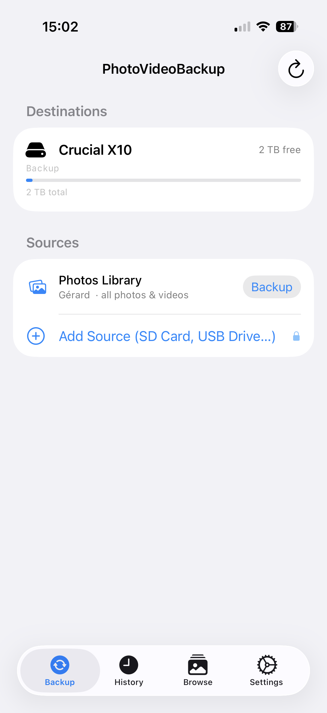

### Step 2 — Start the backup

In the **Sources** section, find the **Photos Library** row. It shows the device name you set in Settings (for example "iPhone de Gérard · all photos & videos").

> If you see "Name not configured" and an orange warning (see below), go to Settings and fill in the **Folder name** field first.

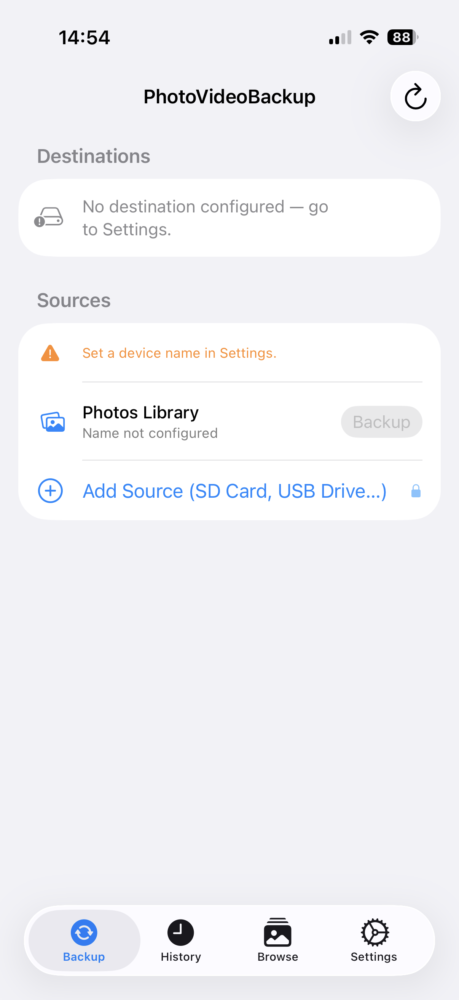

Tap the **Backup** button on that row.

The app will start scanning your photo library and then copying files. You can watch the progress on screen (see [Section 8](#8-the-backup-in-progress)).

> **First backup takes longer.** If you have thousands of photos, expect this to take several minutes or more. Subsequent backups are much faster — the app skips files that are already on the SSD.

---

## 7. Backing Up a Camera SD Card (Pro)

This section explains how to back up a memory card from a camera such as a Blackmagic, Insta360 X5, DJI Mini 3 Pro, DJI 360 / Action camera, GoPro, or any other camera.

> **This feature requires the Pro upgrade.** See [Section 2](#2-free-vs-pro).

### Step 1 — Connect the SD card

Plug your SD card reader into your iPhone and insert the memory card.

If your SSD is already plugged in, you will need a small USB-C hub to connect both at the same time.

### Step 2 — Add the card as a source

On the **Backup** tab, tap **Add Source (SD Card, USB Drive…)** at the bottom of the Sources section.

A file browser will open. Navigate to your SD card and tap **Open**.

### Step 3 — Give it a name

A dialog box will ask you to name this source. The folder name from the card is suggested, but you can type anything — for example **Blackmagic**, **Insta360**, or **Trip to Japan**.

Tap **Add**.

The source now appears in the list. The app automatically recognises known devices:

| Icon | Device |
|------|--------|
| Airplane | DJI Mini 3 Pro |
| Video badge | DJI 360 / Action (Neo 2, etc.) |
| Camera aperture | Insta360 X5 |
| Camera (red) | GoPro HERO series |
| SD card | Everything else |

GoPro cards are scanned for `.mp4` and `.jpg` files; low-resolution proxy files (`.lrv`) and thumbnail files (`.thm`) are automatically skipped.

### Step 4 — Start the backup

Tap **Backup** on the row for your camera source.

### Removing a source

Tap the red **–** button on the left of a source row to remove it from the list. This does not delete any files — it simply removes that card from the app's list of sources.

---

## 8. The Backup in Progress

While the backup runs, a **Backup in Progress** panel replaces the completion banner at the bottom of the Backup tab.

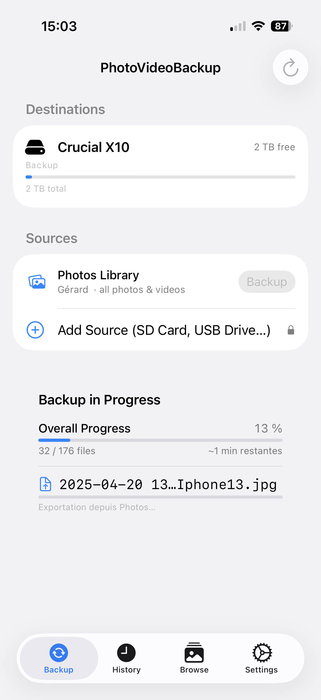

Here is what each part means:

| Element | What it tells you |
|---------|-------------------|
| **Overall Progress** | The percentage of the total backup completed, and how many files done out of the total |
| **Time remaining** | An estimate of how long is left, updated continuously as the backup runs |
| **Current file name** | The file being processed right now |
| **Phase label** | What the app is doing at this moment (see below) |

**Phases explained simply:**

- **Scanning** — The app is counting your files and checking which ones need to be copied.
- **Exporting from Photos** — The app is retrieving the full-quality version of a photo from the iPhone's photo system (or downloading it from iCloud if needed).
- **Copying** — The file is being written to the SSD.
- **Verifying** — The app is double-checking that the copy on the SSD is a perfect match of the original.
- **Skipped** — The file was already on the SSD from a previous backup. Nothing to do.

> Do not unplug the SSD or the SD card while a backup is running.

> **Tip:** If you switch to another app while the backup is running, a notification will appear as soon as it finishes — so you do not need to keep the app open on screen.

---

## 9. When the Backup Is Done

When the backup finishes, a **Backup Complete** banner appears at the bottom of the Backup tab.

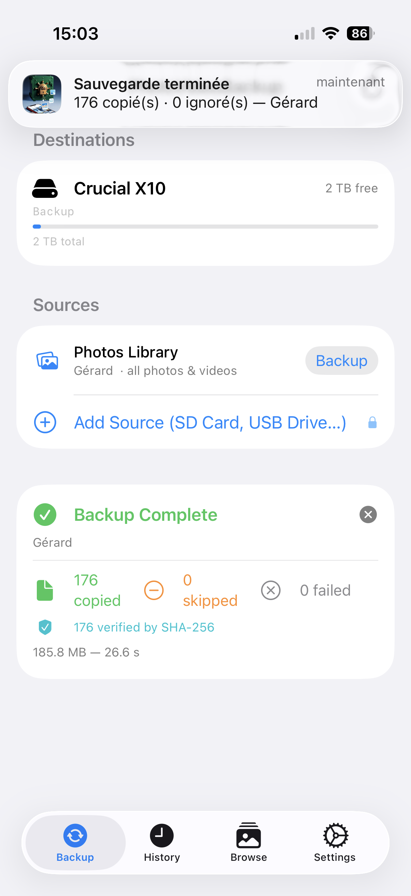

| Number | What it means |
|--------|---------------|
| **Copied** | Files successfully saved to the SSD for the first time |
| **Skipped** | Files that were already on the SSD — not copied again (this is normal and safe) |
| **Failed** | Files that could not be copied (rare — see below) |

The banner also shows the total amount of data copied and how long the backup took.

Tap the **✕** button in the top-right corner of the banner to dismiss it.

### What if some files failed?

A small number of failures is rare but can happen if:
- A file on the SD card is corrupted (damaged card).
- The SSD ran out of space mid-backup.
- The iPhone did not have enough free space for a particularly large file — only that file is skipped, and the rest of the backup continues.
- The connection was briefly interrupted.

For a detailed list of which files failed, open the **History** tab and tap on the session.

---

## 10. Viewing Your Backup History

The **History** tab *(clock icon, centre of the tab bar)* keeps a record of every backup session.

Each row shows the source that was backed up, the destination drive(s), the folder organisation mode, the number of files, and a colour indicator — green for success, orange for partial, red if one or more files failed.

Tap any row to open the full report for that session. The report lists every file: its name, size, capture date, and whether it was copied, skipped, or failed.

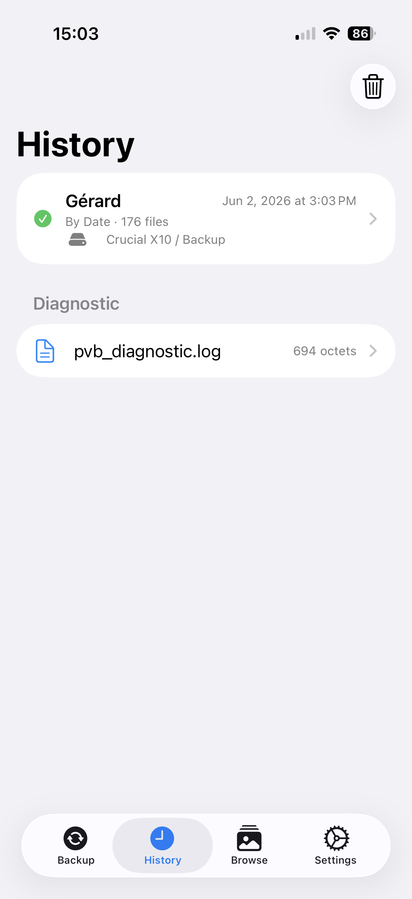

### Sharing a report

Inside a session report, tap the **Share** button (the box-with-arrow icon) to export the report as an HTML file. You can save it, email it, or open it in Safari for a nicely formatted view.

### Deleting source files after backup

Inside a session report, scroll down to find the **Delete Source Files…** button (only visible when the source is connected and files were copied). A four-digit code is shown on screen — type it to confirm. This prevents accidental deletion. The backup on your SSD is not affected.

### Clearing the history

To delete all records, scroll to the bottom of the History tab and tap **Clear History**. This only deletes the records inside the app — it does **not** delete any files on your SSD.

---

## 11. Browsing and Sharing Your Backed-Up Files

The **Browse** tab *(photo stack icon, third from left in the tab bar)* lets you view everything that has been copied to your SSD, directly inside the app.

> Your SSD must be plugged in to browse its contents.

### Navigating your backup

Tap the **Browse** tab. You will see your SSD name with the list of device folders inside it — one folder per device or camera that has been backed up.

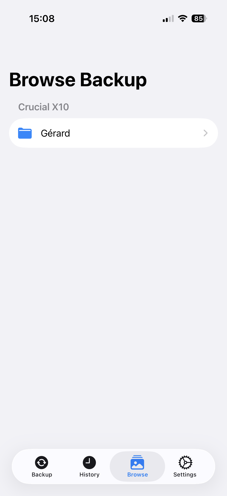

Tap a device folder to open it. At the top you will see a **LUT Grade** section (see below). Below that, the backup dates are listed from newest to oldest.

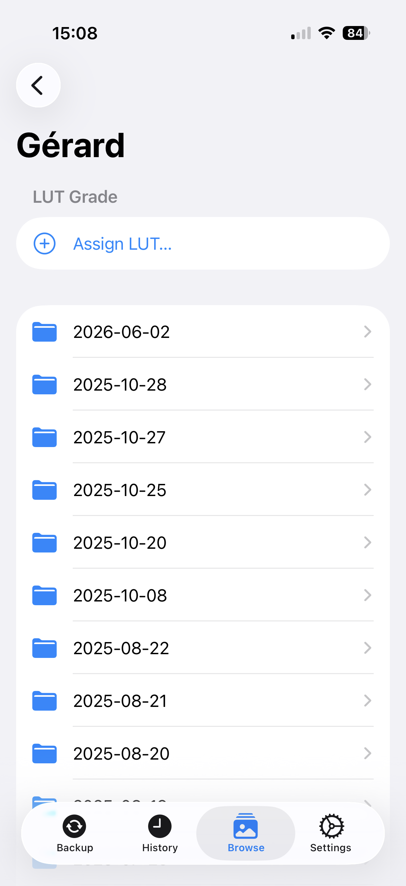

Tap a date to open the media grid for that day: a gallery of thumbnails for all the files copied on that date. Photos show a preview; videos show a thumbnail with a play icon.

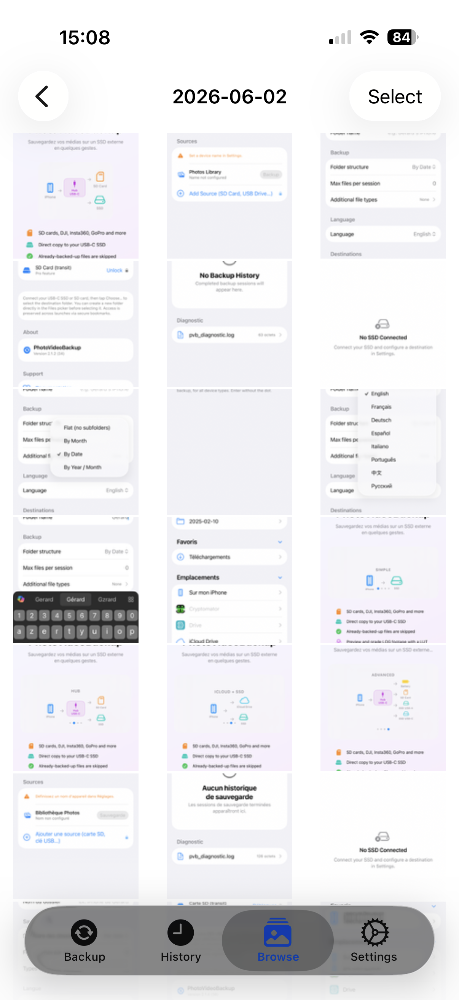

Tap a photo to view it full size. Tap a video to play it in full-screen with transport controls.

### Selecting and sharing files

To send files to another app, AirDrop them, or attach them to a message:

1. Tap **Select** in the top-right corner of the media grid.
2. Tap the thumbnails you want — each one gets a blue checkmark. Unselected items appear dimmed.
3. Tap **Share (N)** in the top-right corner.

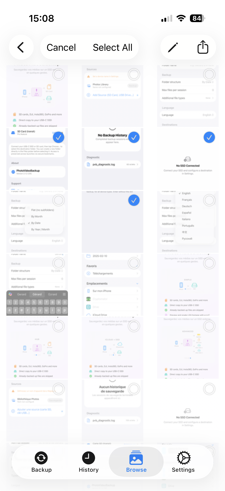

The app copies the selected files to a temporary folder and opens the standard iOS share sheet. From there you can:

- Send via **AirDrop** to a nearby Mac or iPhone
- Attach to a **Messages** or **Mail** message
- Save to the **Photos** library
- Open in **VLC**, **LumaFusion**, **DaVinci Resolve**, or any other compatible app

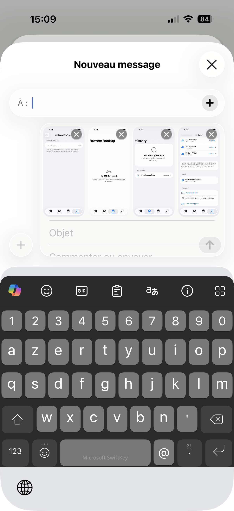

Tap **Cancel** in the toolbar to exit selection mode without sharing.

### Batch rename files

You can rename a group of files at once using a pattern with date tokens, an index counter, and the original filename.

1. Tap **Select** in the top-right corner of the media grid.
2. Tap individual files, or tap **Select All** to select everything in the folder.

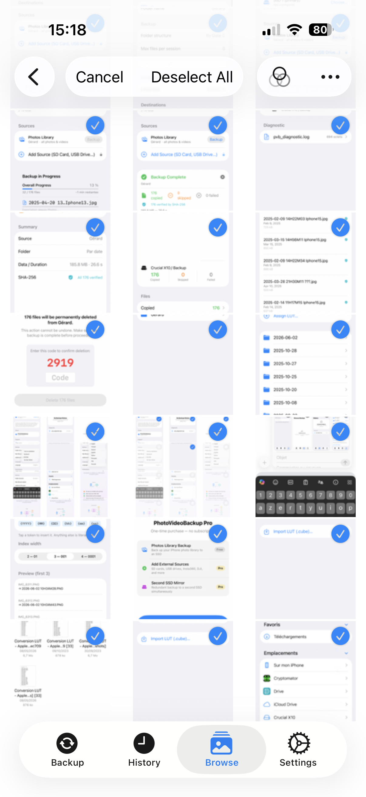

3. Tap **Rename (N)** in the toolbar.

The rename sheet opens with a pattern editor.

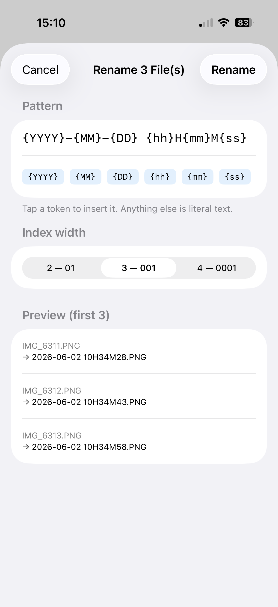

**Available tokens:**

| Token | Replaced by |
|-------|-------------|
| `{YYYY}` | Capture year — e.g. `2026` |
| `{MM}` | Capture month — e.g. `06` |
| `{DD}` | Capture day — e.g. `02` |
| `{hh}` | Capture hour — e.g. `10` |
| `{mm}` | Capture minute — e.g. `34` |
| `{ss}` | Capture second — e.g. `28` |
| `{index}` | Sequential number (width selectable: 2, 3, or 4 digits) |
| `{original}` | Original filename without extension |

Anything typed between tokens is treated as literal text. Tap a token chip to insert it at the cursor. The **Index width** picker controls zero-padding. The **Preview** section shows how the first three filenames will look before you confirm.

> If a target filename already exists, the app appends `_2`, `_3`… automatically.

### LUT Grade — apply a look to LOG footage

If you shoot in **LOG** (DJI D-Log M, GoPro Protune, etc.), your footage looks flat and grey until a LUT (Look Up Table) is applied. The Browse tab lets you assign a LUT to any device folder and preview or permanently grade your footage without leaving the app.

#### Step 1 — Import a LUT

Tap the device folder. In the **LUT Grade** section, tap **Assign LUT…**. Tap **Import LUT (.cube)…** to open the file picker and select a `.cube` file from your Files app, iCloud Drive, or any connected drive. The LUT is copied into the app's storage and is available for all future sessions.

#### Step 2 — Preview with LUT

Once a LUT is assigned, tap any video in that folder. The video plays with the LUT applied in real time.

#### Step 3 — Grade and save

Tap **Grade to "Device (Graded)"**. The app re-encodes all `.mp4` and `.mov` files in **H.265 (HEVC)** with the LUT baked in, saving results in `Device (Graded)/` with the same folder structure. Already-graded files are skipped. Tap **Cancel** to stop at any time.

To remove a LUT assignment, tap **Remove** next to the LUT name.

#### LUT Grade on a NAS

LUT Grade works the same way when backups are on a **NAS**: open a device folder in the NAS section of the Browse tab, assign a LUT, and preview videos with the LUT in real time. To create graded copies, tap **Select**, choose the videos you want to grade, then tap **Grade** — select only your LOG clips (a folder often mixes LOG and non-LOG footage, and a LOG LUT would ruin non-LOG clips; the local SSD flow works identically). Each selected video is downloaded from the NAS, graded on the phone, then uploaded back to a "Device (Graded)" folder on the NAS. This is slower and uses more data than grading a local SSD; already-graded files on the NAS are skipped.

---

## 12. Using Two SSDs — Mirror Backup (Pro)

> **This feature requires the Pro upgrade.** See [Section 2](#2-free-vs-pro).

For extra safety, you can configure a second SSD. Every file will be copied to both SSDs at the same time. If one SSD ever fails, you have a complete copy on the other.

In **Settings**, tap **Choose…** next to "SSD 2 (mirror)" and select a folder on your second SSD.

When both SSDs are plugged in, the Backup tab shows both drives with their available space. The app copies to both simultaneously — the backup does not take twice as long.

> If only one SSD is plugged in when you start a backup, the app will still run but will mark that session as an **incomplete mirror** in the history.

---

## 13. Backing Up to a NAS over Wi-Fi (Pro)

> **This feature requires the Pro upgrade.** See [Section 2](#2-free-vs-pro).

Instead of (or in addition to) a USB-C SSD, you can back up **directly to a NAS** (Synology, QNAP, TrueNAS, or any SMB device) over Wi-Fi. Files are written straight to the NAS — no cable, no intermediate app, no cloud — and each file is verified by SHA-256.

**Set up:** enable SMB sharing on the NAS with a read/write user, then in **Settings → Destinations → NAS (SMB)** fill in Host/IP, Share, optional Folder, Username and Password (stored in the iOS Keychain), tap **Test connection**, then **Save**. The NAS then appears as a destination on the Backup tab and can be used on its own or together with an SSD (all connected destinations receive the backup at once).

**Remote backup:** because it runs over the network, you can back up from anywhere your NAS is reachable — e.g. via a mesh VPN such as **Tailscale** (install it on the NAS and iPhone, keep the VPN active, and use the NAS's Tailscale `100.x.x.x` address as the Host).

> **Mobile data:** when a NAS backup runs over cellular, the app shows a **"You appear to be on mobile data"** banner. Tap **Stop backup** to halt it at any time (the session is marked *Partial*).

**Browse:** the **Browse** tab has a **NAS** section to navigate its folders; tapping a photo/video downloads it on demand for a preview (videos play full-screen with a live LUT toggle). Device folders on the NAS also offer the full **LUT Grade** feature (see Section 11 → *LUT Grade on a NAS*).

---

## 14. Frequently Asked Questions

**Q: Does the app delete files from my iPhone or SD card?**  
No. PhotoVideoBackup only copies files. It never moves or deletes anything from the source.

**Q: My NAS connection times out — what's wrong?**  
A timeout almost always means the NAS isn't reachable on the network, not an app problem. Check the same Wi-Fi (or an active VPN), that SMB sharing is on, and any NAS firewall. With Tailscale, make sure the VPN is on and the iPhone is allowed to reach the NAS.

**Q: Will it copy the same file twice if I run it again?**  
No. The app checks whether each file is already on the SSD before copying. Files that are already there are skipped. Running the backup a second time is fast and safe.

**Q: My SD card appears as "Documents" — is that normal?**  
Yes, some cameras store footage in a generic folder. When you add the source, simply type a meaningful name (like "Blackmagic" or "GoPro") in the naming dialog so you can recognise it easily.

**Q: The app says "No SSD configured — go to Settings." What do I do?**  
Your SSD is either not plugged in, or you have not set up a destination folder yet. Plug in the SSD and follow the steps in [Section 5](#5-setting-up-your-ssd).

**Q: Some photos take a long time and the app says "Exporting from Photos" — why?**  
Those photos are stored in iCloud and are not fully downloaded on your iPhone. The app automatically downloads them before copying. This requires a Wi-Fi or cellular connection and takes extra time depending on your internet speed.

**Q: Can I use the app on two different iPhones to back up to the same SSD?**  
Yes. Each iPhone has its own **Folder name** setting (in Settings → iPhone / iPad). Give each device a different name before the first backup — for example **iPhone de Gérard** on one and **iPhone de Camille** on the other. Each device will create its own folder on the SSD and the files will never get mixed up.

**Q: The progress bar says 3% and seems stuck — is it frozen?**  
Probably not. The first few files processed during a backup of the iPhone photo library are often large video files, which take longer individually. The percentage will start moving faster once it gets to smaller files. Wait a few minutes before worrying.

**Q: What does "SHA-256 verification" mean?**  
It is a way of confirming that the copy on the SSD is a perfect, bit-for-bit match of the original. You do not need to understand how it works — if the backup completes without failed files, your backup is guaranteed to be identical to the source.

**Q: Is my data sent anywhere? Does it go through the internet?**  
No. Everything happens locally between your iPhone and your SSD. The only exception is when the app downloads a photo from iCloud to copy it — but that is your own data, from your own iCloud account, going to your own SSD. The app has no server, no account, and no cloud storage of its own.

**Q: Can I back up when my iPhone is almost full?**  
Yes. Each photo or video is streamed straight to the destination instead of being copied to the iPhone first, so only a few megabytes are held at a time whatever the file size. A backup to a NAS **on its own** is the exception — it still needs room for one file at a time. If a file genuinely cannot fit, only that file fails and the run continues; free up space and run again to pick it up.

**Q: Does backing up to iCloud Drive free space on my iPhone?**  
Yes, from 2.3.0. Once iCloud confirms a file is uploaded, its local copy is released and a placeholder remains — the file stays in iCloud and in the Files app, and downloads again on demand. This never happens before the upload is confirmed. It frees the space taken by the *copies*; use **Delete Source Files…** in the session report to reclaim the originals in the Photos Library.

**Q: Can I use iCloud Drive as a destination instead of an SSD?**  
Yes. When choosing a destination folder in Settings, you can navigate to iCloud Drive and select a folder there. The app will copy your files into iCloud Drive exactly as it would to a physical SSD.

**Q: Is the incremental backup still reliable when the destination is iCloud Drive?**  
Yes. The app checks whether a file is already present by reading its metadata (name and size) at the destination. iOS exposes this metadata for iCloud Drive files even when their content has been offloaded to save space, so the skip logic works correctly regardless of whether the files are locally stored or cloud-only.

**Q: Can I use the app to back up an SSD to iCloud Drive?**  
Yes. Any folder you can open with the iOS file browser can be used as a source — including a folder on an external SSD. Select the SSD folder as your source and an iCloud Drive folder as your destination, and the app will copy only the files that are not already there.

**Q: What does the app offer over simply copying files manually in the Files app?**  
When copying to iCloud Drive, the app adds: automatic incremental transfers (only new files are copied), SHA-256 integrity verification on every file, a detailed session report listing what was copied, skipped, or failed, and support for two destinations simultaneously (for example an SSD and iCloud Drive in a single pass).

**Q: Is the app available in my language?**  
Yes. The app supports English, French (Français), German (Deutsch), Spanish (Español), Italian (Italiano), Portuguese (Português), Chinese Simplified (中文), and Russian (Русский). By default it follows your iPhone's system language. You can also override it manually: open the **Settings** tab, scroll to the **Language** section, and pick the language you want. The change takes effect immediately — no restart needed.

---

*Documentation last updated: May 29, 2026*

---

[Privacy Policy](privacy-policy.html)
